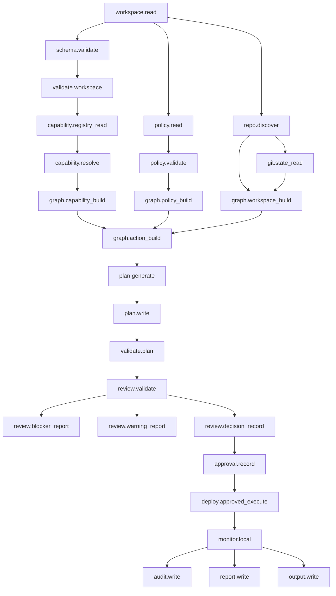

# Kiste v0.9.10 — Global Capability Dependency Graph

Status: Architecture addendum  
Release: `0.9.10`  
Theme: Dependency graph for every Kiste capability family, not only IAM.

---

## 1. Correction

The capability dependency graph is not only for IAM.

v0.9.10 introduces a global capability dependency graph for all Kiste capability families.

IAM and key management are one important subgraph, but the same dependency graph model applies to:

```text
workspace.*
repo.*
git.*
schema.*
validate.*
capability.*
policy.*
graph.*
plan.*
review.*
approval.*
audit.*
report.*
output.*
monitor.*
hook.*
sdk.*
unit.*
tool.*
container.*
oci.*
compose.*
runtime.*
kubernetes.*
gitops.*
progressive.*
iam.*
security.*
hardware.*
ai.*
model.*
dataset.*
inference.*
agent.*
rag.*
gpu.*
mlops.*
```

---

## 2. Purpose

Kiste must know which capabilities depend on which other capabilities before it can safely plan, review, deploy, or monitor.

The dependency graph answers:

```text
What must exist before this capability can run?
What capability provides the required input?
What policy gates must pass first?
What capabilities are optional extensions?
What capabilities are blockers if missing?
What can run in read-only mode?
What requires approval?
What requires audit evidence?
```

---

## 3. Core Rule

```text
Every Kiste capability must be graphable.
```

A capability is valid only if Kiste can declare:

```text
name
family
stage
provides
requires
optional_requires
policy_gates
mutation_level
approval_required
evidence_required
outputs
```

---

## 4. Global Dependency Layers

Kiste capability dependencies should generally follow this order:

```text
Layer 0: minimum operating kernel
Layer 1: workspace and repository facts
Layer 2: schema, policy, and capability resolution
Layer 3: graph construction
Layer 4: inspect and validate
Layer 5: plan generation
Layer 6: review, approval, and evidence
Layer 7: approved mutation / deploy
Layer 8: monitor, audit, drift, and feedback
Layer 9: advanced tool/runtime/AI/IAM extensions
```

---

## 5. Global Dependency Graph



---

## 6. Extension Subgraphs

### Hook and tool integration subgraph

```text
hook.contract -> hook.registry -> hook.policy -> hook.runtime -> tool.normalize_output -> plan.fragment -> review.evidence -> monitor.signal
```

### Container / OCI / Compose subgraph

```text
container.detect -> container.dockerfile_read -> oci.image_ref -> oci.metadata -> compose.detect -> compose.service_graph -> runtime.kubernetes_lize -> runtime.manifest_generate
```

### Kubernetes runtime subgraph

```text
runtime.manifest_generate -> runtime.manifest_validation -> runtime.dry_run -> review.validate -> approval.record -> runtime.apply_approved -> runtime.health -> runtime.drift
```

### GitOps / progressive delivery subgraph

```text
git.update -> gitops.manifest_export -> gitops.environment_layout -> promotion.policy_gate -> progressive.strategy -> rollout.plan -> analysis.metric_check -> approval.record -> rollout.promote_or_abort -> rollback.plan
```

### IAM / key management subgraph

```text
iam.identity.ref -> iam.trust.policy -> iam.key.ref -> iam.secret.ref -> iam.signing.plan -> iam.policy_analyze -> iam.least_privilege_check -> iam.permission_boundary_check -> iam.action_plan -> review.validate -> approval.record -> iam.approved_apply -> iam.*.audit
```

### AI / ML workload subgraph

```text
model.artifact -> dataset.lineage -> inference.endpoint -> gpu.scheduling -> safety.policy -> eval.report -> review.validate -> approval.record -> monitor.ai_workload
```

---

## 7. Capability Dependency Object

```yaml
apiVersion: kiste.dev/v0.9.10
kind: CapabilityDependencyGraph

metadata:
  name: global-capability-dependency-graph

spec:
  root: kiste

  nodes:
    - name: workspace.read
      family: workspace
      stage: read
      mutation: none
      required_for_core: true

    - name: plan.generate
      family: plan
      stage: plan
      requires:
        - graph.action_build
        - policy.validate
        - capability.resolve
      mutation: none
      required_for_core: true

    - name: runtime.apply_approved
      family: runtime
      stage: deploy
      requires:
        - runtime.manifest_validation
        - review.validate
        - approval.record
      mutation: runtime
      required_for_core: false

    - name: iam.approved_apply
      family: iam
      stage: deploy
      requires:
        - iam.action_plan
        - review.validate
        - approval.record
        - iam.trust.policy
      mutation: external-system
      required_for_core: false
```

---

## 8. Required Outputs

Kiste v0.9.10 should emit:

```text
.kiste/capabilities/global-capability-dependency-graph.json
.kiste/capabilities/core-kernel-dependency-graph.json
.kiste/capabilities/runtime-capability-dependency-graph.json
.kiste/capabilities/gitops-capability-dependency-graph.json
.kiste/capabilities/iam-capability-dependency-graph.json
.kiste/capabilities/ai-capability-dependency-graph.json
.kiste/capabilities/missing-capability-report.json
.kiste/capabilities/capability-blocker-report.json
```

---

## 9. Acceptance Criteria

v0.9.10 is accepted only if:

```text
1. Kiste can represent every capability as a graph node.
2. Kiste can represent dependency edges between capabilities.
3. Kiste can mark required vs optional dependencies.
4. Kiste can identify missing dependencies.
5. Kiste can identify blocker dependencies.
6. Kiste can identify mutation capabilities requiring approval.
7. Kiste can emit a global dependency graph.
8. Kiste can emit subgraphs for core, runtime, GitOps, IAM, and AI.
9. IAM/key management is modeled as one subgraph, not the whole graph.
10. Review blocks plans whose required dependency graph is incomplete.
```

---

## 10. Final Rule

```text
The v0.9.10 dependency graph is for every Kiste capability.

IAM and key management are only one privileged subgraph.

Kiste Core validates capability dependency graphs before planning, review, deploy, and monitor.

A capability that cannot declare its dependencies cannot safely participate in Kiste.
```
