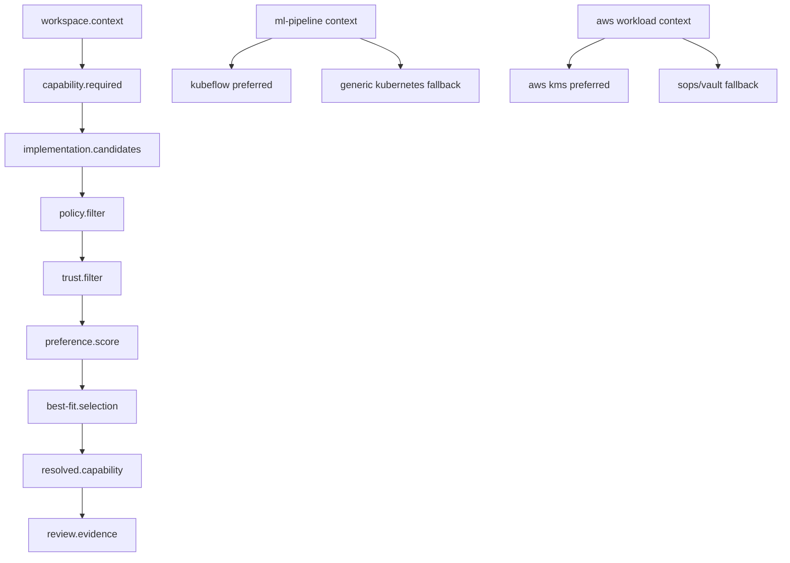

# Kiste v0.9.11 — Capability Preference and Tool Fit Model

Status: Architecture proposal  
Release: `0.9.11`  
Theme: Capabilities decide what is possible; preferences decide what is best for a specific workspace, workload, and environment.

---

## 1. Purpose

v0.9.10 makes Kiste capability-first and removes provider as a first-class model.

v0.9.11 adds the next layer:

```text
Capability is not enough.
Kiste also needs preference and fit.
```

Many tools can satisfy the same capability, but not all implementations are equally good for every job.

Examples:

```text
Generic Kubernetes can run ML workloads.
Kubeflow is usually a better fit for ML pipelines.

Generic Kubernetes Secret can hold a secret ref.
AWS KMS is a better fit for AWS-bound encrypted workloads.

Generic container runtime can run inference.
A GPU-aware inference runtime is a better fit for model serving.

Generic GitOps can apply manifests.
Argo CD or Flux may be a better fit depending on the workspace.
```

Core rule:

```text
Capabilities determine eligibility.
Preferences determine selection.
```

---

## 2. Correction from v0.9.10

v0.9.10 says:

```text
Kiste resolves capabilities to tool-backed KisteUnit implementations inside a workspace.
```

v0.9.11 adds:

```text
When several implementations can satisfy a capability, Kiste scores and selects them using preference, fit, policy, and context.
```

So the model becomes:

```text
CapabilityDependencyGraph
  -> CapabilityImplementationGraph
  -> CapabilityPreferenceGraph
  -> ResolvedCapabilityGraph
```

---

## 3. Why Preference Is Needed

Without preference, Kiste may select the lowest-common-denominator implementation.

Bad outcome:

```text
Need ML workflow orchestration.
Kiste sees runtime.kubernetes is available.
Kiste chooses generic Kubernetes manifests.
But Kubeflow would have been a better fit.
```

Better outcome:

```text
Need ML workflow orchestration.
Kiste sees both generic Kubernetes and Kubeflow implementations.
Kiste scores Kubeflow higher because workload.type = ml-pipeline.
Kiste selects Kubeflow or recommends it.
```

Preference helps avoid abstraction flattening.

---

## 4. Capability vs Preference

### Capability

Capability answers:

```text
Can this implementation do the job?
```

### Preference

Preference answers:

```text
Is this implementation the best fit for this job?
```

### Policy

Policy answers:

```text
Is this implementation allowed?
```

### Review

Review answers:

```text
Is this selected implementation safe and justified?
```

---

## 5. Preference Model

A preference can be based on:

```text
workload type
environment
cloud/account boundary
region
runtime
cost
latency
security posture
IAM/key boundary
team preference
organization standard
compliance requirement
tool maturity
existing deployment footprint
operator skill
lock-in tolerance
fallback availability
```

Preference is not absolute.

It is context-specific.

---

## 6. Preference Object

```yaml
apiVersion: kiste.dev/v0.9.11
kind: CapabilityPreference

metadata:
  name: ml-pipeline-preference

spec:
  applies_to:
    capabilities:
      - mlops.pipeline
      - dataset.lineage
      - model.train
      - model.eval

  context:
    workload_type: ml-pipeline
    runtime: kubernetes

  prefer:
    - implementation: kubeflow-integration-unit
      reason: better-fit-for-ml-pipelines
      weight: 90

    - implementation: generic-kubernetes-runtime
      reason: fallback-only
      weight: 40

  policy:
    allow_fallback: true
    require_review_if_lower_preference_selected: true
```

---

## 7. Preference Score

Kiste may calculate a fit score.

Suggested scoring dimensions:

```text
capability_match
workload_fit
environment_fit
security_fit
identity_fit
data_fit
cost_fit
operational_fit
team_fit
fallback_fit
```

Example score object:

```json
{
  "schema": "kiste.capability-fit-score/v0.9.11",
  "capability": "mlops.pipeline",
  "candidate": "kubeflow-integration-unit",
  "score": 91,
  "dimensions": {
    "capability_match": 100,
    "workload_fit": 95,
    "environment_fit": 90,
    "security_fit": 85,
    "operational_fit": 80
  },
  "decision": "preferred"
}
```

---

## 8. Example: Kubeflow vs Generic Kubernetes

Capability required:

```text
mlops.pipeline
model.train
dataset.lineage
model.eval
runtime.kubernetes
```

Candidate implementations:

```text
generic-kubernetes-runtime
kubeflow-integration-unit
argo-workflows-integration-unit
```

Preference rule:

```text
If workload.type = ml-pipeline and runtime = kubernetes, prefer Kubeflow over generic Kubernetes.
```

Example:

```yaml
capability_resolution:
  mlops.pipeline:
    candidates:
      - unit: github.com/KisteBox/kiste-unit-kubeflow
        tool: kubeflow
        fit: preferred
        reason: native-ml-pipeline-support

      - unit: github.com/KisteBox/kiste-unit-kubernetes
        tool: kubernetes
        fit: fallback
        reason: generic-runtime-only
```

Rule:

```text
Generic Kubernetes remains valid, but it is not always preferred.
```

---

## 9. Example: AWS KMS for AWS-Bound Workloads

Capability required:

```text
iam.key.ref
iam.key.encryption_ref
iam.signing.artifact
iam.trust.policy
```

Candidate implementations:

```text
aws-kms-integration-unit
sops-integration-unit
vault-integration-unit
local-keyring-integration-unit
```

Preference rule:

```text
If workload.cloud = aws and identity.boundary = aws-account, prefer AWS KMS.
```

But AWS KMS should not be preferred for every workload.

```text
AWS KMS is preferred for AWS-bound jobs.
AWS KMS is not automatically preferred for local-only, multi-cloud, or offline jobs.
```

Example:

```yaml
capability_preferences:
  iam.key.encryption_ref:
    context:
      cloud: aws
      account_boundary: same-aws-account
      region: ap-southeast-1

    prefer:
      - unit: github.com/KisteBox/kiste-unit-aws-kms
        tool: aws-kms
        weight: 95
        reason: same-cloud-key-boundary

    fallback:
      - unit: github.com/KisteBox/kiste-unit-sops
        tool: sops
        weight: 70
        reason: portable-encrypted-file
```

---

## 10. Preference Is Not Policy

Preference can recommend.

Policy can block.

Example:

```text
Preference says: AWS KMS is best for AWS workload.
Policy says: AWS KMS is not allowed in this workspace.
Result: Kiste must not select AWS KMS.
```

Final priority order:

```text
1. Policy
2. Required capability compatibility
3. Trust boundary
4. Preference score
5. Fallback availability
```

---

## 11. Workspace Preference Shape

```yaml
apiVersion: kiste.dev/v0.9.11
kind: Workspace

spec:
  requires:
    capabilities:
      - mlops.pipeline
      - model.train
      - dataset.lineage
      - iam.key.encryption_ref
      - runtime.kubernetes

  context:
    workload_type: ml-pipeline
    cloud: aws
    region: ap-southeast-1
    runtime: kubernetes

  tools:
    allowed:
      - kubernetes
      - kubeflow
      - aws-kms
      - sops

  units:
    requires:
      - module: github.com/KisteBox/kiste-unit-kubeflow
        version: v0.1.0
      - module: github.com/KisteBox/kiste-unit-aws-kms
        version: v0.1.0
      - module: github.com/KisteBox/kiste-unit-kubernetes
        version: v0.2.0

  capability_preferences:
    strategy: best-fit-allowed

    rules:
      - when:
          workload_type: ml-pipeline
          runtime: kubernetes
        prefer:
          tool: kubeflow
          over: kubernetes
          reason: better-fit-for-ml-pipelines

      - when:
          cloud: aws
          account_boundary: same-aws-account
        prefer:
          tool: aws-kms
          for:
            - iam.key.encryption_ref
            - iam.signing.artifact
          reason: same-cloud-key-boundary
```

---

## 12. Capability Preference Graph



---

## 13. Preference Report

Kiste should emit:

```text
.kiste/capabilities/capability-preference-graph.json
.kiste/capabilities/capability-fit-score-report.json
.kiste/capabilities/implementation-selection-report.json
.kiste/review/preference-decision-evidence.json
```

Example report:

```json
{
  "schema": "kiste.capability-preference-report/v0.9.11",
  "capability": "mlops.pipeline",
  "selected": "kubeflow-integration-unit",
  "reason": "better-fit-for-ml-pipelines",
  "fallbacks": [
    "generic-kubernetes-runtime",
    "argo-workflows-integration-unit"
  ],
  "policy_status": "allowed",
  "review_required": true
}
```

---

## 14. Review Requirements

Review must show why an implementation was selected.

Review evidence should include:

```text
required capability
candidate implementations
policy filter result
trust filter result
preference scores
selected implementation
fallback implementation
reason for selection
risk of lower-preference fallback
```

Rule:

```text
If Kiste selects a lower-preference implementation, review must explain why.
```

---

## 15. Non-Goals

v0.9.11 does not add:

```text
automatic marketplace ranking
paid provider recommendation
black-box tool selection
hardcoded vendor preference
always-prefer-cloud rule
always-prefer-Kubernetes rule
always-prefer-AWS rule
```

Preferences must be explainable, local to workspace policy, and reviewable.

---

## 16. Acceptance Criteria

v0.9.11 is accepted only if:

```text
1. Kiste supports CapabilityPreference objects.
2. Kiste can score multiple implementation candidates for one capability.
3. Policy always overrides preference.
4. Workspace context influences preference.
5. Tool fit influences selection.
6. Kiste can prefer Kubeflow over generic Kubernetes for ML pipeline capabilities.
7. Kiste can prefer AWS KMS for AWS-bound key capabilities.
8. Kiste can keep generic Kubernetes as fallback.
9. Kiste emits a capability preference graph.
10. Kiste emits a fit score report.
11. Review includes preference decision evidence.
12. Lower-preference selections require explanation.
```

---

## 17. Final Rule

```text
Capability tells Kiste what is needed.
Tool tells Kiste what can implement it.
KisteUnit integrates the tool.
Workspace policy says what is allowed.
Preference says what is best for this job.

Kiste must not only resolve capabilities.
Kiste must resolve best-fit allowed capabilities.
```
