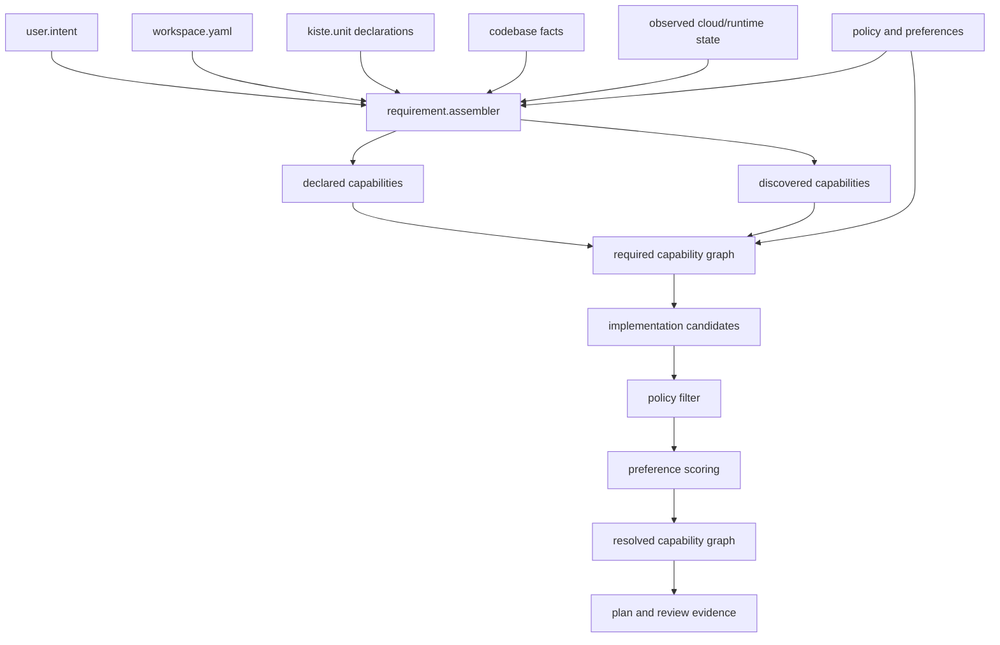

# Kiste v0.9.12 — Capability Requirement Assembly

Status: Architecture proposal  
Release: `0.9.12`  
Theme: Assemble the required capability graph from intent, codebase, Unit definitions, and observed external state.

---

## 1. Purpose

Kiste must not require users to manually list every capability.

v0.9.12 introduces capability requirement assembly.

Kiste derives the capability graph from multiple evidence sources:

```text
User intent
Workspace configuration
KisteUnit declarations
Source code and repository structure
Dependency manifests
Infrastructure definitions
Existing tool configuration
Observed cloud/runtime state
Organization policy
Environment constraints
```

Core rule:

```text
Intent states the desired outcome.
Inspection discovers the current system.
Kiste assembles the required capability graph between them.
```

---

## 2. Why Manual Capability Lists Are Not Enough

A user may say:

```text
Deploy this API safely to AWS.
```

The codebase and current state may imply:

```text
Python application
Docker build
ECR registry
ECS Fargate runtime
ALB ingress
private subnets
AWS KMS encryption
CloudWatch monitoring
GitHub Actions delivery
```

The full capability requirement may therefore include:

```text
source.read
code.python.inspect
container.build
container.image.publish
network.private_runtime
runtime.ecs_fargate
traffic.load_balance
iam.workload_identity
iam.key.encryption_ref
observability.logs
observability.metrics
deployment.plan
deployment.apply
recheck.runtime_health
```

The user should not have to know and declare every internal capability name.

---

## 3. Assembly Inputs

### 3.1 Declared intent

Intent describes the desired outcome.

Examples:

```text
Run this service in production.
Move this application to Kubernetes.
Create an ML pipeline.
Reduce cloud cost without changing availability.
Use AWS-native identity and encryption.
```

Intent may come from:

```text
CLI request
Workspace YAML
API request
UI form
Git issue or change request
Control Unit lifecycle request
```

### 3.2 Codebase evidence

Kiste inspects:

```text
Languages
Frameworks
Dependency manifests
Dockerfiles
Compose files
Kubernetes manifests
Terraform/Pulumi/CloudFormation
CI/CD files
Database migrations
Model files
Data pipeline definitions
Runtime configuration
```

### 3.3 KisteUnit declarations

Units contribute:

```text
Provided capabilities
Required capabilities
Optional capabilities
Conflicting capabilities
Inputs and outputs
Permissions
Lifecycle requirements
Tool integrations
```

### 3.4 Observed external state

Kiste may inspect current state through read-only Units and tools:

```text
Current cloud accounts
Existing VPCs and subnets
Current IAM roles and trust policies
Existing KMS keys
Current Kubernetes clusters
Running workloads
Container registries
DNS and certificates
Current CI/CD configuration
Monitoring systems
Runtime health and drift
```

### 3.5 Policy and organizational constraints

Examples:

```text
Production must use approved encryption.
No public database endpoints.
AWS workloads must use workload identity.
ML pipelines should prefer Kubeflow.
Production changes require rollback and approval.
Only pinned KisteUnits are allowed.
```

---

## 4. Four Capability Sets

Kiste should assemble four related sets:

```text
Declared capabilities
Discovered capabilities
Required capabilities
Selected implementation capabilities
```

### Declared

Explicitly requested by workspace, Unit, user, or policy.

### Discovered

Detected from code, config, tools, or observed state.

### Required

Capabilities necessary to move from current state to intended state safely.

### Selected implementation

Capabilities provided by the chosen Units and tools.

---

## 5. Capability Requirement Assembly Flow

```text
1. Parse intent.
2. Read workspace and Unit definitions.
3. Inspect codebase and repository graph.
4. Inspect existing infrastructure and runtime state.
5. Load policy and environment constraints.
6. Produce discovered facts.
7. Map facts and intent to capability requirements.
8. Expand transitive capability dependencies.
9. Detect conflicts and missing evidence.
10. Build the required capability graph.
11. Find candidate KisteUnits and tools.
12. Apply policy and preference.
13. Produce the resolved capability graph.
14. Generate review evidence.
```

---

## 6. Assembly Graph



---

## 7. Capability Requirement Object

```yaml
apiVersion: kiste.dev/v0.9.12
kind: CapabilityRequirementSet

metadata:
  name: payment-api-production

spec:
  intent:
    action: deploy
    target: production
    outcome: run-payment-api-safely

  evidence:
    workspaceRef: payments/workspace
    unitRefs:
      - payments/payment-api

    codebase:
      languages:
        - python
      files:
        - Dockerfile
        - requirements.txt
        - .github/workflows/deploy.yml

    observedState:
      cloud: aws
      runtime: ecs-fargate
      region: ap-southeast-1
      existingResources:
        - vpc
        - private-subnets
        - alb
        - ecr-repository

  capabilities:
    declared:
      - deployment.production

    discovered:
      - code.python
      - container.dockerfile
      - ci.github-actions
      - runtime.ecs-fargate

    required:
      - container.build
      - container.image.publish
      - runtime.ecs-fargate
      - traffic.load-balance
      - iam.workload-identity
      - iam.key.encryption-ref
      - observability.logs
      - runtime.health
      - approval.record
      - evidence.append
```

---

## 8. Evidence and Confidence

Every inferred requirement should record why it exists.

Example:

```json
{
  "capability": "container.build",
  "source": "codebase",
  "evidence": {
    "file": "Dockerfile",
    "digest": "sha256:..."
  },
  "confidence": 1.0,
  "required": true
}
```

A weaker inference:

```json
{
  "capability": "database.postgresql",
  "source": "dependency-analysis",
  "evidence": {
    "package": "psycopg"
  },
  "confidence": 0.7,
  "required": "unconfirmed"
}
```

Rule:

```text
Low-confidence requirements must be reviewed or verified before mutation.
```

---

## 9. Current-State-Aware Assembly

The same intent may produce different capability graphs depending on current state.

### Case A: nothing exists

Intent:

```text
Deploy API to AWS.
```

Required capabilities may include:

```text
network.vpc.create
network.subnet.create
registry.create
runtime.create
identity.role.create
load-balancer.create
```

### Case B: infrastructure already exists

Required capabilities may only include:

```text
container.build
container.image.publish
runtime.service.update
runtime.health
```

Therefore:

```text
Capability requirements are a function of desired intent and observed state.
```

---

## 10. Unit-Centered Assembly

Because KisteUnit is the atomic object, capability assembly occurs through Units.

```text
Intent
  -> target Unit graph
  -> Unit requirements
  -> capability requirements
  -> implementation Units
```

Example:

```text
payment-api Unit
  requires container.image
  requires database.connection
  requires deployment.apply

container Unit
  provides container.image
  requires container.build
  requires registry.write

runtime Unit
  provides deployment.apply
  requires iam.workload-identity
  requires network.private-connectivity
```

The global capability graph is assembled from the Unit graph, not maintained as an unrelated list.

---

## 11. Role of the Control Unit

The Kiste Control Unit coordinates assembly.

It provides:

```text
intent.read
workspace.resolve
unit.discover
unit.graph.resolve
state.observe
capability.requirement.assemble
capability.graph.expand
capability.conflict.detect
capability.evidence.record
```

It does not invent requirements without evidence.

Rule:

```text
Every required capability must be explicit, declared, inferred with evidence, or introduced by policy.
```

---

## 12. SDK Requirements

The KisteUnit SDK should provide APIs for Units to contribute discovery and requirements.

Conceptual interface:

```go
type RequirementContributor interface {
    Discover(ctx Context) ([]Fact, error)
    InferRequirements(intent Intent, facts []Fact) ([]CapabilityRequirement, error)
}
```

Python example:

```python
class DockerUnit:
    def discover(self, context):
        if context.files.exists("Dockerfile"):
            return [Fact("container.dockerfile", confidence=1.0)]
        return []

    def infer_requirements(self, intent, facts):
        if intent.action == "deploy" and "container.dockerfile" in facts:
            return [
                CapabilityRequirement("container.build"),
                CapabilityRequirement("container.image.publish"),
            ]
        return []
```

---

## 13. Generated Outputs

```text
.kiste/facts/codebase-facts.json
.kiste/facts/workspace-facts.json
.kiste/facts/observed-state.json
.kiste/intent/resolved-intent.json
.kiste/capabilities/declared-capabilities.json
.kiste/capabilities/discovered-capabilities.json
.kiste/capabilities/required-capability-graph.json
.kiste/capabilities/resolved-capability-graph.json
.kiste/capabilities/missing-capability-report.json
.kiste/review/capability-requirement-evidence.json
```

---

## 14. Safety Rules

```text
Read and inspect state before assembling mutation requirements.
Do not treat stale state as current without marking it.
Do not silently invent required capabilities.
Record source and confidence for inferred capabilities.
Policy may add or block requirements.
Preference may rank implementations but may not override policy.
Unknown capability requirements block mutation.
Changed state invalidates affected plans.
```

Capability assembly must bind to:

```text
Intent digest
Workspace digest
Unit graph digest
Codebase revision
Observed-state timestamp and digest
Policy digest
Capability graph digest
```

---

## 15. Acceptance Criteria

v0.9.12 is accepted only if:

```text
1. Kiste can parse declared intent.
2. Kiste can discover capabilities from a codebase.
3. Kiste can read capability declarations from Units.
4. Kiste can inspect current cloud/runtime state through read-only Units.
5. Kiste can combine declared and discovered capabilities.
6. Kiste can infer required capabilities with evidence.
7. Kiste can expand transitive capability dependencies.
8. Kiste can detect missing and conflicting capabilities.
9. Kiste can generate a required capability graph.
10. Kiste can resolve implementation Units and tools.
11. Policy overrides preference and inference.
12. Low-confidence requirements require review.
13. Plans are bound to the state used during assembly.
14. Changed observed state can invalidate a plan.
15. Capability assembly is Unit-centered.
```

---

## 16. Final Rule

```text
Kiste does not merely read a static list of capabilities.

Kiste assembles capability requirements from:

  intent
  workspace configuration
  KisteUnit declarations
  codebase evidence
  dependency and infrastructure files
  current cloud and runtime state
  policy and environment constraints

The result is an evidence-backed required capability graph.

That graph is then resolved to the best-fit allowed KisteUnits and tools before planning and review.
```
